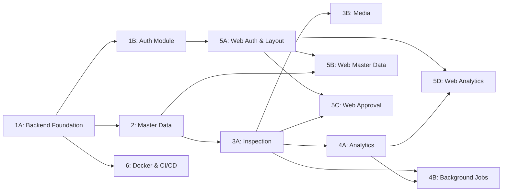

# Implementation Tracking — RSUD Ajibarang Server Stack

## Claim Order & Dependency Map



## Issues List

### Phase 1 — Foundation & Auth

| Issue | ID | Status | Claimed By | Blocked By | 
|-------|----|--------|------------|------------|
| **1A: Backend Foundation** | `rsud-server-stack-5xr` | 🟢 Done | k3ntoes@gmail.com | None |
| **1B: Auth Module** | `rsud-server-stack-3f5` | 🟢 Done | k3ntoes@gmail.com | 1A |

### Phase 2 — Master Data

| Issue | ID | Status | Claimed By | Blocked By |
|-------|----|--------|------------|------------|
| **2: Master Data Module** | `rsud-server-stack-pvb` | 🟢 Done | k3ntoes@gmail.com | 1A |

### Phase 3 — Inspection & Media

| Issue | ID | Status | Claimed By | Blocked By |
|-------|----|--------|------------|------------|
| **3A: Inspection Module** | `rsud-server-stack-5e5` | 🟢 Done | k3ntoes@gmail.com | 2 |
| **3B: Media Module** | `rsud-server-stack-2u0` | 🟢 Done | k3ntoes@gmail.com | 3A |

### Phase 4 — Analytics & Background

| Issue | ID | Status | Claimed By | Blocked By |
|-------|----|--------|------------|------------|
| **4A: Analytics Module** | `rsud-server-stack-wrx` | 🟢 Done | k3ntoes@gmail.com | 3A |
| **4B: Background Jobs** | `rsud-server-stack-4hy` | 🟢 Done | k3ntoes@gmail.com | 3A, 4A |

### Phase 5 — Web Admin Frontend

| Issue | ID | Status | Claimed By | Blocked By |
|-------|----|--------|------------|------------|
| **5A: Auth & Layout** | `rsud-server-stack-9j4` | 🟢 Done | k3ntoes@gmail.com | 1B |
| **5B: Master Data Pages** | `rsud-server-stack-esm` | 🟢 Done | k3ntoes@gmail.com | 5A, 2 |
| **5C: Approval Workflow** | `rsud-server-stack-h6k` | 🟢 Done | k3ntoes@gmail.com | 5A, 3A, 3B |
| **5D: Analytics Dashboard** | `rsud-server-stack-u4h` | 🟢 Done | k3ntoes@gmail.com | 5A, 4A |

### Phase 6 — Infrastructure

| Issue | ID | Status | Claimed By | Blocked By |
|-------|----|--------|------------|------------|
| **6: Docker & CI/CD** | `rsud-server-stack-quy` | 🟢 Done | k3ntoes@gmail.com | 1A, 5A |

### Phase 7 — User Management & Monitoring

| Issue | ID | Status | Claimed By | Blocked By |
|-------|----|--------|------------|------------|
| **7A: User & Role CRUD** | `rsud-server-stack-43k` | 🟢 Done | k3ntoes@gmail.com | 1B, 5A |
| **7B: Inspector Monitoring** | `rsud-server-stack-3yk` | 🟢 Done | k3ntoes@gmail.com | 3A, 7A |
| **7C: Change Password** | `rsud-server-stack-3yl` | 🟢 Done | k3ntoes@gmail.com | 7A |

---

## Phase 7 — Detail Perubahan

### Backend

| File | Perubahan |
|------|-----------|
| `backend/app/modules/auth/schemas.py` | +UserCreate, UserUpdate, UserListOut, ChangePasswordRequest |
| `backend/app/modules/auth/services.py` | +list_users, update_user, deactivate_user, change_password |
| `backend/app/modules/auth/api.py` | +GET/POST/PUT/DELETE /users, +POST /change-password |
| `backend/app/modules/analytics/schemas.py` | +InspectorPerformanceOut |
| `backend/app/modules/analytics/services.py` | +get_inspector_performance |
| `backend/app/modules/analytics/api.py` | +GET /inspector-performance |

### Frontend

| File | Perubahan |
|------|-----------|
| `web-admin/src/hooks/useUsers.ts` | Hooks baru: useUsers, useCreateUser, useUpdateUser, useDeleteUser, useChangePassword, useInspectorPerformance, ROLES constant |
| `web-admin/src/routes/users.tsx` | Halaman manajemen pengguna (CRUD table + modal) |
| `web-admin/src/routes/inspectors.tsx` | Halaman monitoring kinerja inspector (bar chart) |
| `web-admin/src/components/Layout.tsx` | +Sidebar links (Pengguna, Kinerja Inspector), +Modal Change Password |
| `web-admin/src/main.tsx` | Register UsersRoute, InspectorsRoute |

---

## Workflow Per Issue

### Sebelum Mengerjakan

1. **Baca CONTEXT.md terkait** — pahami glossary dan key decisions domain
   - Cari di `CONTEXT-MAP.md` → buka `src/<domain>/CONTEXT.md`
2. **Baca CODING-RULES.md** — pahami YAGNI/KISS/DRY, max 300 baris, aturan gitnexus & context7
3. **Baca ADR terkait** — cek di `docs/adr/` untuk keputusan arsitektural yang relevan
4. **Claim issue**: `bd update <issue-id> --claim`
5. **Update tracking file** — ubah status issue di tabel atas menjadi 🟡 In Progress

### Selama Mengerjakan

- Ikuti **CODING-RULES.md** — terutama YAGNI, KISS, DRY, max 300 baris
- Gunakan **GitNexus** untuk memahami codebase (`query`, `context`, `impact`)
- Gunakan **Context7** untuk best practices library (jika tools tersedia)
- Patuhi arsitektur 3-layer per module (api.py → services.py → models.py)
- Ikuti aturan di `docs/04-architecture.md` dan `docs/01-database-schema.md`

### Setelah Selesai

1. **`bd update <issue-id> --status done`** — tandai selesai di beads
2. **Update tracking file ini** — ubah status di tabel atas menjadi 🟢 Done
3. **GitNexus `detect_changes()`** — verifikasi blast radius
4. **Jika issue membuka dependensi (blocked issues)** — notifikasi bahwa issue tersebut siap dikerjakan

---

## Recommended Claim Order

Prioritas dari grilling:
> **1A → 1B → 2 → 3A+3B (parallel) → 4A+4B (parallel)**

Frontend bisa mulai paralel setelah 1B selesai:
> **5A → 5B → 5C+5D (parallel)**

Infrastructure:
> **6** bisa dikerjakan kapan saja setelah 1A

### Quick Start
```
# Claim issue
bd update rsud-server-stack-5xr --claim

# Lihat detail issue
bd show rsud-server-stack-5xr

# Tandai selesai
bd update rsud-server-stack-5xr --status done
```

---

## Pre-Commit Checklist (setiap issue)

- [ ] Semua test passing
- [ ] Tidak ada debug code / console.log
- [ ] Tidak ada commented-out code
- [ ] Tidak ada file > 300 baris
- [ ] Tidak ada duplikasi yang tidak perlu
- [ ] GitNexus `detect_changes()` sudah dijalankan
- [ ] Sesuai dengan ADRs dan CONTEXT.md
- [ ] Update CODING-RULES.md jika ada aturan baru
- [ ] Status tracking file ini sudah diupdate

---

## Legend

| Symbol | Arti |
|--------|------|
| 🔴 Open | Belum dikerjakan |
| 🟡 In Progress | Sedang dikerjakan (claimed) |
| 🟢 Done | Selesai |
| ⏸️ Blocked | Menunggu issue lain |
