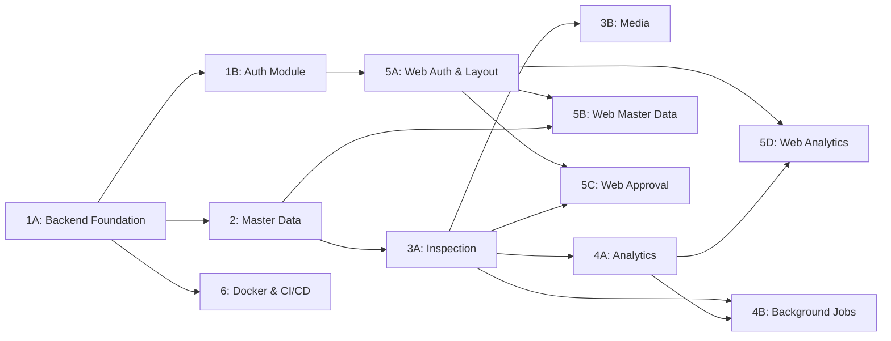

# Implementation Tracking — RSUD Ajibarang Server Stack

## Claim Order & Dependency Map


```mermaid
flowchart LR
    IA["1A: Backend Foundation"] --> IB["1B: Auth Module"]
    IA --> II["2: Master Data"]
    IA --> VI["6: Docker & CI/CD"]
    IB --> VA["5A: Web Auth & Layout"]
    II --> IIIA["3A: Inspection"]
    IIIA --> IIIB["3B: Media"]
    IIIA --> IVA["4A: Analytics"]
    IIIA --> IVB["4B: Background Jobs"]
    IVA --> IVB
    VA --> VB["5B: Web Master Data"]
    VA --> VC["5C: Web Approval"]
    VA --> VD["5D: Web Analytics"]
    II --> VB
    IIIA --> VC
    IVA --> VD
```

## Issues List

### Phase 1 — Foundation & Auth

| Issue | ID | Status | Claimed By | Blocked By | 
|-------|----|--------|------------|------------|
| **1A: Backend Foundation** | `rsud-server-stack-5xr` | 🟢 Done | k3ntoes@gmail.com | None |
| **1B: Auth Module** | `rsud-server-stack-3f5` | 🟢 Done | k3ntoes@gmail.com | 1A |

### Phase 2 — Master Data

| Issue | ID | Status | Claimed By | Blocked By |
|-------|----|--------|------------|------------|
| **2: Master Data Module** | `rsud-server-stack-pvb` | 🟢 Done | k3ntoes@gmail.com | 1A |

### Phase 3 — Inspection & Media

| Issue | ID | Status | Claimed By | Blocked By |
|-------|----|--------|------------|------------|
| **3A: Inspection Module** | `rsud-server-stack-5e5` | 🟢 Done | k3ntoes@gmail.com | 2 |
| **3B: Media Module** | `rsud-server-stack-2u0` | 🟢 Done | k3ntoes@gmail.com | 3A |

### Phase 4 — Analytics & Background

| Issue | ID | Status | Claimed By | Blocked By |
|-------|----|--------|------------|------------|
| **4A: Analytics Module** | `rsud-server-stack-wrx` | 🟢 Done | k3ntoes@gmail.com | 3A |
| **4B: Background Jobs** | `rsud-server-stack-4hy` | 🟢 Done | k3ntoes@gmail.com | 3A, 4A |

### Phase 5 — Web Admin Frontend

| Issue | ID | Status | Claimed By | Blocked By |
|-------|----|--------|------------|------------|
| **5A: Auth & Layout** | `rsud-server-stack-9j4` | 🟢 Done | k3ntoes@gmail.com | 1B |
| **5B: Master Data Pages** | `rsud-server-stack-esm` | 🟢 Done | k3ntoes@gmail.com | 5A, 2 |
| **5C: Approval Workflow** | `rsud-server-stack-h6k` | 🟢 Done | k3ntoes@gmail.com | 5A, 3A, 3B |
| **5D: Analytics Dashboard** | `rsud-server-stack-u4h` | 🟢 Done | k3ntoes@gmail.com | 5A, 4A |

### Phase 6 — Infrastructure

| Issue | ID | Status | Claimed By | Blocked By |
|-------|----|--------|------------|------------|
| **6: Docker & CI/CD** | `rsud-server-stack-quy` | 🟢 Done | k3ntoes@gmail.com | 1A, 5A |

### Phase 7 — User Management & Monitoring

| Issue | ID | Status | Claimed By | Blocked By |
|-------|----|--------|------------|------------|
| **7A: User & Role CRUD** | `rsud-server-stack-43k` | 🟢 Done | k3ntoes@gmail.com | 1B, 5A |
| **7B: Inspector Monitoring** | `rsud-server-stack-3yk` | 🟢 Done | k3ntoes@gmail.com | 3A, 7A |
| **7C: Change Password** | `rsud-server-stack-3yl` | 🟢 Done | k3ntoes@gmail.com | 7A |

---

## Phase 7 — Detail Perubahan

### Backend

| File | Perubahan |
|------|-----------|
| `backend/app/modules/auth/schemas.py` | +UserCreate, UserUpdate, UserListOut, ChangePasswordRequest |
| `backend/app/modules/auth/services.py` | +list_users, update_user, deactivate_user, change_password |
| `backend/app/modules/auth/api.py` | +GET/POST/PUT/DELETE /users, +POST /change-password |
| `backend/app/modules/analytics/schemas.py` | +InspectorPerformanceOut |
| `backend/app/modules/analytics/services.py` | +get_inspector_performance |
| `backend/app/modules/analytics/api.py` | +GET /inspector-performance |

### Frontend

| File | Perubahan |
|------|-----------|
| `web-admin/src/hooks/useUsers.ts` | Hooks baru: useUsers, useCreateUser, useUpdateUser, useDeleteUser, useChangePassword, useInspectorPerformance, ROLES constant |
| `web-admin/src/routes/users.tsx` | Halaman manajemen pengguna (CRUD table + modal) |
| `web-admin/src/routes/inspectors.tsx` | Halaman monitoring kinerja inspector (bar chart) |
| `web-admin/src/components/Layout.tsx` | +Sidebar links (Pengguna, Kinerja Inspector), +Modal Change Password |
| `web-admin/src/main.tsx` | Register UsersRoute, InspectorsRoute |

---

### Phase 8 — Android API Contract

| Issue | ID | Status | Claimed By | Blocked By |
|-------|----|--------|------------|------------|
| **8A: Dual Delivery Auth** | `rsud-server-stack-oun` | 🟢 Done | k3ntoes@gmail.com | None |
| **8B: Master Data Auth & Sync** | `rsud-server-stack-f7g` | 🟢 Done | k3ntoes@gmail.com | None |
| **8C: Upload Response & File Limit** | `rsud-server-stack-xnk` | 🟢 Done | k3ntoes@gmail.com | None |
| **8D: Error Code Standardization** | `rsud-server-stack-1y8` | 🟢 Done | k3ntoes@gmail.com | 8A (overlap) |

---

## Phase 8 — Detail Perubahan

### Backend

| File | Perubahan |
|------|-----------|
| `backend/app/modules/auth/api.py` | +RefreshRequest body fallback di refresh; +body di logout; +TOKEN_EXPIRED/TOKEN_INVALID error codes |
| `backend/app/modules/auth/schemas.py` | +RefreshRequest schema |
| `backend/app/modules/master/api.py` | GET endpoints gunakan get_current_user (bukan admin); +?since= query |
| `backend/app/modules/master/models.py` | +updated_at (DateTime, nullable) di Room dan InspectionItem |
| `backend/app/modules/master/schemas.py` | +updated_at di RoomOut, ItemOut; +SyncResponse wrapper |
| `backend/app/modules/master/services.py` | +filter ?since=; +updated_at auto-set on create/update/delete |
| `backend/app/modules/media/api.py` | +photo_file_name, thumbnail_file_name, file_size; +FILE_TOO_LARGE code |
| `backend/app/modules/media/services.py` | +chunked file read (64KB); +10MB safety net |
| `backend/app/modules/inspection/api.py` | +DUPLICATE_INSPECTION error code |
| `backend/app/alembic/versions/` | `c2e9ef77ab08` — add updated_at to rooms and inspection_items |
| `backend/app/core/errors.py` | **NEW** — error_response() helper with standardized `code` field |

### Tests

| File | Perubahan |
|------|-----------|
| `backend/tests/test_master.py` | Updated — GET endpoints now 200 (not 403) for non-admin users |

---

### Phase 11 — Optimasi & Perbaikan Dashboard

| Issue | ID | Status | Claimed By | Blocked By |
|-------|----|--------|------------|------------|
| **11A: Dedicated Dashboard Endpoint** | — | 🟢 Done | — | 4A, 5D |
| **11B: Room Badges UI** | — | 🟢 Done | — | 9 (Room-Items) |
| **11C: Documentasi & ADR** | — | 🟢 Done | — | 11A, 11B |

---

## Phase 11 — Detail Perubahan

### Ringkasan

| Area | Sebelum | Sesudah |
|------|---------|---------|
| Dashboard API calls | 3 panggilan: `/inspections`, `/rooms`, `/analytics/summary` | **1 panggilan:** `/analytics/dashboard` |
| Dashboard Frontend hooks | `useInspections` + `useRoomsAll` + `useDashboardSummary` | **1 hook:** `useDashboardData()` |
| Rooms table | Kolom Nama + Status + Aksi saja | +Kolom **Item Inspeksi** (badge nama item) |
| Data room‑items | Fetch per-room via modal | Fetch all via `useAllRoomItems()`, join di memory |
| `per_page` limit master API | `le=100` (rooms/items) | `le=10000` (mendukung get-all pattern) |
| React Query DevTools | Tidak ada | ✅ Terpasang (dev only, auto tree-shake) |

### Backend

| File | Perubahan |
|------|-----------|
| `backend/app/modules/analytics/schemas.py` | +`DashboardSummaryOut`, +`DashboardOut` |
| `backend/app/modules/analytics/services.py` | +`get_dashboard_summary()`, +`get_dashboard_data()` (3 aggregate queries dalam 1 fungsi) |
| `backend/app/modules/analytics/api.py` | +`GET /api/analytics/summary`, +`GET /api/analytics/dashboard` |
| `backend/app/modules/master/api.py` | `per_page` limit `le=100` → `le=10000` untuk rooms & items |

### Frontend — Dashboard

| File | Perubahan |
|------|-----------|
| `web-admin/src/hooks/useAnalytics.ts` | +`useDashboardSummary()`, +`useDashboardData()` (1 hook menggantikan 3) |
| `web-admin/src/routes/dashboard.tsx` | Ganti 3 hook (`useInspections`, `useRoomsAll`, `useDashboardSummary`) → 1 `useDashboardData()` |

### Frontend — Room Badges (rooms + items + inspectors)

| File | Perubahan |
|------|-----------|
| `web-admin/src/hooks/useMasterData.ts` | +`useAllRoomItems()` (fetch all pivot data via `/api/room-items`) |
| `web-admin/src/components/MasterDataPage.tsx` | +`renderBadges` prop opsional → kolom badge otomatis muncul; +pagination state (pageIndex, pageSize), +search, +sorting via DataTable |
| `web-admin/src/routes/rooms.tsx` | Build `itemNameMap` via `useMemo` + kirim `renderBadges` ke `MasterDataPage` (badge teal) |
| `web-admin/src/routes/items.tsx` | +`useAllRoomItems()` + `roomNameMap` via `useMemo` + `renderBadges` (badge navy — rooms per item) |
| `web-admin/src/routes/inspectors.tsx` | +`useUsers()` + `useRoomsAll()` + `userRoomMap` via `useMemo` + badge ruangan per inspector (badge navy) |
| `docs/patterns/room-item-badges.md` | **NEW** — Dokumentasi pola renderBadges + useAllRoomItems + lookup mapping |

### Frontend — DevTools

| File | Perubahan |
|------|-----------|
| `web-admin/package.json` | +`@tanstack/react-query-devtools` dependency |
| `web-admin/src/main.tsx` | +`ReactQueryDevtools` (`initialIsOpen=false`, `buttonPosition="bottom-left"`) |

### Backend — User-Rooms Bulk Sync

| File | Perubahan |
|------|-----------|
| `backend/app/modules/auth/services.py` | +`list_all_user_rooms(db, since)` — query semua `UserRoom` pivot dengan filter `since` |
| `backend/app/modules/auth/api.py` | +`GET /api/auth/user-rooms?since=...` → `SyncResponse<UserRoomOut>` (any authenticated user) |
| `web-admin/src/hooks/useUsers.ts` | +`useAllUserRooms()` hook untuk Android sync (queryKey `["user-rooms", "all"]`) |

### Dokumentasi

| File | Perubahan |
|------|-----------|
| `docs/04-architecture.md` | Update frontend stack (React Query DevTools, Nginx), analytics module endpoints, related docs |
| `docs/10-pagination-architecture.md` | Update `per_page` limit (100→10000), catatan dual limit, temuan baru #5 |
| `docs/03-project-structure.md` | Update component/routes/hooks list |
| `docs/android-implementation-guide.md` | **NEW** — Panduan lengkap implementasi Android (pagination, room-items, dashboard, sync strategy), +✅ verifikasi endpoint section, +user-rooms sync (Step 4), +catatan detail inspeksi (room_name/inspector_name lookup), +lampiran fields inspection |
| `docs/android-to-be-api-contract.md` | Fix section 4.2 (submit inspection response — hapus `message`/`detail_count` palsu), fix section 4.4 (get detail — hapus `room_name`/`inspector_name` palsu) |
| `docs/adr/0011-dashboard-dedicated-endpoint.md` | **NEW** — ADR untuk dedicated dashboard endpoint |
| `CONTEXT-MAP.md` | Update: ADR-0011 di index, Recent Updates table, test count 35→68 |
| `backend/app/modules/auth/CONTEXT.md` | Fix Admin Reset Password kontradiksi, +user-rooms dan My Rooms endpoint di Key Decisions |
| `backend/app/modules/analytics/CONTEXT.md` | Update Dashboard → dedicated endpoint, hapus "Two Metrics" usang, +ADR-0011 |
| `web-admin/CONTEXT.md` | +DataTable, MasterDataPage, renderBadges, useDebounce, React Query DevTools, hooks baru |

### Verifikasi Endpoint

46 endpoint diverifikasi — semua sudah diimplementasi di backend. Tidak ada endpoint yang perlu ditambahkan. Hasil verifikasi didokumentasikan di `docs/android-implementation-guide.md` (section ✅ Hasil Verifikasi Endpoint) dan `docs/android-to-be-api-contract.md`.

---

### Phase 12 — ADR-0013 Room-Item Ordering (Urutan Item per Ruangan)

| Issue | ID | Status | Claimed By | Blocked By |
|-------|----|--------|------------|------------|
| **12A: Backend — Kolom `sort_order` + ordering service** | `rsud-server-stack-wvc` | 🟢 Done | Bagus Sudrajat | None |
| **12B: Backend — Endpoint reorder + sync bump** | `rsud-server-stack-3j5` | 🟢 Done | Bagus Sudrajat | 12A |
| **12C: Web-admin — UI tombol ▲/▼** | `rsud-server-stack-65s` | 🟢 Done | Bagus Sudrajat | 12B |
| **12D: Android — Konsumsi `sort_order`** | `rsud-server-stack-odx` | 🟢 Done (docs) | Bagus Sudrajat | 12A |

---

## Phase 12 — Detail Perubahan

### Ringkasan

| Area | Sebelum | Sesudah |
|------|---------|---------|
| Urutan item per ruangan | Tidak diatur — ikut insertion order (`id`) | **Diatur admin** via `sort_order` di pivot `room_items` (ADR-0013) |
| Ordering query | Tanpa `ORDER BY` (`list_items_by_room`) | `ORDER BY sort_order ASC, item_id ASC` |
| Item baru di-assign | Posisi tidak jelas | Append di akhir ruangan (`max(sort_order)+1`) |
| Reorder via web-admin | Tidak ada | Tombol ▲/▼ per item (tanpa library drag & drop) |
| Sync ke Android | Hanya data assignment | `sort_order` ikut terkirim; reorder di-bump `updated_at` → terlihat via `?since=` |

### Backend

| File | Perubahan |
|------|-----------|
| `backend/app/alembic/versions/008_room_items_sort_order.py` | **NEW** — +`sort_order` (Integer, default 0) di `room_items` + backfill `sort_order = item_id` |
| `backend/app/modules/master/models.py` | +`RoomItem.sort_order` (Integer, default 0) |
| `backend/app/modules/master/schemas.py` | +`RoomItemOut.sort_order`; +`RoomItemReorder` schema (`item_ids: list[int]`) |
| `backend/app/modules/master/services.py` | `list_room_items()` & `list_items_by_room()` → `ORDER BY sort_order ASC, item_id ASC`; `assign_item_to_room()` → append `max+1`; +`reorder_room_items()` (hanya baris berubah yang di-bump `updated_at`) |
| `backend/app/modules/master/api.py` | +`PUT /api/rooms/{id}/items/reorder` (admin-only; 404 room not found, 422 item_ids mismatch) |

### Frontend

| File | Perubahan |
|------|-----------|
| `web-admin/src/hooks/useMasterData.ts` | `RoomItem` interface +`sort_order`/`is_active`/`updated_at`; +`useReorderRoomItems()` mutation (invalidate `["room-items"]` & `["rooms"]`) |
| `web-admin/src/routes/rooms.tsx` | Modal Room +daftar **Urutan Checklist** (nomor urut + tombol ▲/▼, disabled di posisi ujung, rollback saat gagal) |

### Android Docs

| File | Perubahan |
|------|-----------|
| `docs/android-implementation-guide.md` | `RoomItemDto`/`RoomItemEntity` +`sort_order`; aturan urut `(sort_order, item_id)`; contoh Kotlin sync + DAO query `ORDER BY sort_order ASC, item_id ASC` |
| `docs/android-to-be-api-contract.md` | Payload `sort_order` di §2.2 + contoh Kotlin + alur sync (sudah ter-update, diikuti oleh 12D) |
| `docs/01-database-schema.md` | Pivot `room_items` +`sort_order` (Integer, default 0 — ADR-0013) |
| `docs/adr/0013-room-item-ordering.md` | **NEW** — ADR-0013 (kolom `sort_order`, ordering deterministik, reorder via sync, UI ▲/▼) |

### Tests

| File | Perubahan |
|------|-----------|
| `backend/tests/test_room_items.py` | +8 test: ordering `sort_order`, assign append di akhir, payload sync memuat `sort_order`, reorder normal, item invalid ditolak (422), sync bump `?since=`, forbidden non-admin (403), room not found (404) |

> ✅ **Verifikasi**: 167 backend tests pass · `npx tsc --noEmit` + `npm run build` pass · migration `008` ter-apply ke dev DB (backfill `sort_order = item_id` terverifikasi).

---

## Workflow Per Issue

### Sebelum Mengerjakan

1. **Baca CODING-RULES.md** — pahami YAGNI/KISS/DRY, max 300 baris, aturan gitnexus & context7
   - File ini tidak auto-read — agent WAJIB baca manual.
2. **Baca CONTEXT.md terkait** — pahami glossary dan key decisions domain
   - Cari di `CONTEXT-MAP.md` → buka `src/<domain>/CONTEXT.md`
3. **Baca ADR terkait** — cek di `docs/adr/` untuk keputusan arsitektural yang relevan
4. **Claim issue**: `bd update <issue-id> --claim`
5. **Update tracking file** — ubah status issue di tabel atas menjadi 🟡 In Progress

### Selama Mengerjakan

- Ikuti **CODING-RULES.md** — terutama YAGNI, KISS, DRY, max 300 baris
- Gunakan **GitNexus** untuk memahami codebase (`query`, `context`, `impact`)
- Gunakan **Context7** untuk best practices library (jika tools tersedia)
- Patuhi arsitektur 3-layer per module (api.py → services.py → models.py)
- Ikuti aturan di `docs/04-architecture.md` dan `docs/01-database-schema.md`

### Setelah Selesai

1. **`bd update <issue-id> --status closed`** — tandai selesai di beads
2. **Update tracking file ini** — ubah status di tabel atas menjadi 🟢 Done
3. **GitNexus `detect_changes()`** — verifikasi blast radius
4. **Jika issue membuka dependensi (blocked issues)** — notifikasi bahwa issue tersebut siap dikerjakan

---

## Recommended Claim Order

Prioritas dari grilling:
> **1A → 1B → 2 → 3A+3B (parallel) → 4A+4B (parallel)**

Frontend bisa mulai paralel setelah 1B selesai:
> **5A → 5B → 5C+5D (parallel)**

Infrastructure:
> **6** bisa dikerjakan kapan saja setelah 1A

### Quick Start
```
# Claim issue
bd update rsud-server-stack-5xr --claim

# Lihat detail issue
bd show rsud-server-stack-5xr

# Tandai selesai
bd update rsud-server-stack-5xr --status closed
```

---

## Pre-Commit Checklist (setiap issue)

- [ ] Semua test passing
- [ ] Tidak ada debug code / console.log
- [ ] Tidak ada commented-out code
- [ ] Tidak ada file > 300 baris
- [ ] Tidak ada duplikasi yang tidak perlu
- [ ] GitNexus `detect_changes()` sudah dijalankan
- [ ] Sesuai dengan ADRs dan CONTEXT.md
- [ ] Update CODING-RULES.md jika ada aturan baru
- [ ] Status tracking file ini sudah diupdate

---

## Legend

| Symbol | Arti |
|--------|------|
| 🔴 Open | Belum dikerjakan |
| 🟡 In Progress | Sedang dikerjakan (claimed) |
| 🟢 Done | Selesai |
| ⏸️ Blocked | Menunggu issue lain |
