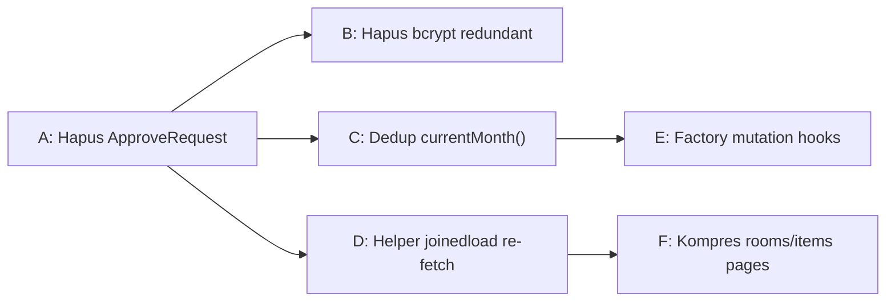

# Refactoring Tracker — Ponytail-Review Code Improvements

Tracking issues from **ponytail-review** (code quality improvements based on over-engineering analysis).

---

## Claim Order & Dependency Map



**Prioritas eksekusi:**
1. 🔥 **Trivial cleanup** (A → B) — zero risk, bisa langsung
2. 🔥 **Small refactor** (C → E) — dedup kecil, type-safe
3. ⏳ **Medium refactor** (D) — perlu test passing
4. ⏳ **Larger refactor** (F) — perlu component design

---

## Issues List

| # | Issue ID | Title | Status | Claimed By | Blocked By |
|---|----------|-------|--------|------------|------------|
| A | `rsud-server-stack-0lr` | [Cleanup] Hapus `ApproveRequest` model tidak terpakai | 🟢 Done | Buffy | None |
| B | `rsud-server-stack-4hc` | [Cleanup] Hapus dependency bcrypt redundant dari `pyproject.toml` | 🔵 Wontfix | — | Konflik CONTEXT-MAP.md: pin bcrypt<4.1 sengaja untuk kompatibilitas passlib |
| C | `rsud-server-stack-9g1` | [Cleanup] Dedup fungsi `currentMonth()` yang terduplikasi | 🟢 Done | Buffy | None |
| D | `rsud-server-stack-8x4` | [Refactor] Ekstrak helper untuk joinedload re-fetch di `inspection/services.py` | 🟢 Done | Buffy | None |
| E | `rsud-server-stack-83x` | [Refactor] Factory untuk mutation hooks identik di `useMasterData.ts` | 🟢 Done | Buffy | C |
| F | `rsud-server-stack-26n` | [Refactor] Kompres halaman `rooms.tsx` dan `items.tsx` menjadi komponen CRUD generik | 🟢 Done | Buffy | A, D |

---

## Pre-Work Checklist (Wajib Sebelum Mengerjakan)

Setiap AI agent **WAJIB** melakukan ini sebelum menyentuh kode:

- [ ] **Baca CODING-RULES.md** — pahami YAGNI/KISS/DRY, max 300 baris, aturan GitNexus
- [ ] **Baca CONTEXT terkait** — cari di `CONTEXT-MAP.md` → buka `backend/app/modules/<domain>/CONTEXT.md`
  - Issue D: `backend/app/modules/inspection/CONTEXT.md`
  - Issue E, F, C: `backend/app/modules/master/CONTEXT.md` (master data domain)
- [ ] **Baca ADR terkait** — `docs/adr/` untuk keputusan arsitektural yang relevan
  - Issue D: `docs/adr/0002-multi-photo-schema.md`
- [ ] **GitNexus impact analysis** — jalankan `impact()` sebelum mengubah symbol apapun
  - Lihat `.claude/skills/gitnexus/gitnexus-impact-analysis/SKILL.md`
- [ ] **Claim issue**: `bd update <issue-id> --claim`
- [ ] **Update tracking file ini** — ubah status issue di tabel atas menjadi 🟡 In Progress

---

## Workflow Per Issue

### Selama Mengerjakan

- Ikuti **CODING-RULES.md** — terutama DRY, max 300 baris, YAGNI
- Gunakan **GitNexus** untuk memahami codebase (`query`, `context`, `impact`)
- Gunakan **Context7** untuk best practices library (jika tools tersedia)
- Patuhi arsitektur 3-layer per module (api.py → services.py → models.py)
- Ikuti aturan di `docs/04-architecture.md` dan `docs/01-database-schema.md`

### Setelah Selesai

1. **Jalankan test** — pastikan tidak ada regresi:
   ```bash
   # Backend
   cd backend && uv run pytest -v
   
   # Frontend (typecheck)
   cd web-admin && npx tsc -b
   ```
2. **`bd update <issue-id> --status done`** — tandai selesai di beads
3. **Update tracking file ini** — ubah status issue di tabel atas menjadi 🟢 Done
4. **Commit & push**:
   ```bash
   git add .
   git commit -m "<type>: <deskripsi singkat>"
   git push
   ```
5. **Jika issue membuka dependensi (blocked issues)** — notifikasi bahwa issue tersebut siap dikerjakan

---

## Completed

Semua issue telah dikerjakan:
- **A**: Hapus `ApproveRequest` dari `schemas.py`
- **B**: Skip — konflik CONTEXT-MAP.md (pin bcrypt disengaja)
- **C**: export `currentMonth` dari `useAnalytics.ts`, import di `analytics.tsx`
- **D**: Extract `_refetch_inspection()` — 4 call site pakai helper
- **E**: Factory hooks `useCreateMutation`/`useUpdateMutation`/`useDeleteMutation`
- **F**: Generic `MasterDataPage.tsx` — rooms.tsx & items.tsx jadi ~25 baris masing-masing

---

## Pre-Commit Checklist (setiap issue)

- [ ] Semua test passing (`pytest -v`)
- [ ] Frontend typecheck OK (`tsc -b`)
- [ ] Tidak ada debug code / console.log
- [ ] Tidak ada commented-out code
- [ ] Tidak ada file > 300 baris
- [ ] Tidak ada duplikasi yang tidak perlu
- [ ] Sesuai dengan ADRs dan CONTEXT.md
- [ ] Update tracking file ini (status issue di tabel)
- [ ] Beads issue ditutup (`bd update <id> --status done`)
- [ ] Commit & push sudah dilakukan

---

## Legend

| Symbol | Arti |
|--------|------|
| 🔴 Open | Belum dikerjakan |
| 🟡 In Progress | Sedang dikerjakan (claimed) |
| 🟢 Done | Selesai |
| 🔵 Wontfix | Tidak akan dikerjakan (ada alasan) |
| ⏸️ Blocked | Menunggu issue lain |
