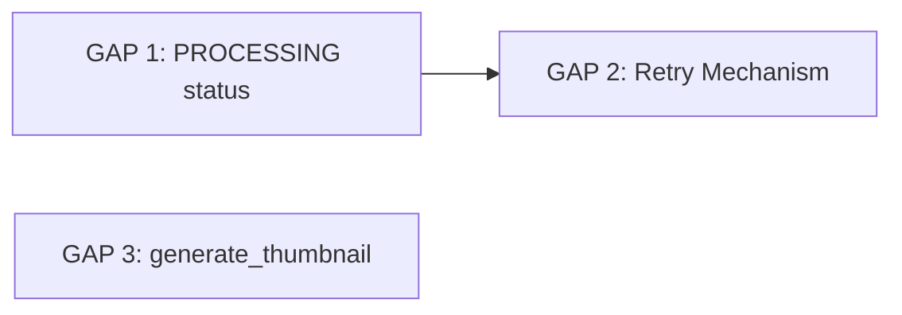

# Background Jobs — Gap Fix Tracking

> **Ditemukan:** 2026-07-22 — Audit kesesuaian CONTEXT vs implementasi kode untuk background jobs (job perhitungan).
>
> **Context primer:** `backend/app/modules/background/CONTEXT.md`
> **Context terkait:** `backend/app/modules/analytics/CONTEXT.md`, `docs/00-core-prompt.md`, `docs/04-architecture.md`

---

## Ringkasan Gap

| # | Gap | CONTEXT bilang | Kode realita | Prioritas | Beads Issue |
|---|-----|---------------|-------------|-----------|-------------|
| 1 | State machine missing `PROCESSING` | `PENDING → PROCESSING → COMPLETED / FAILED` | Hanya `PENDING → COMPLETED / FAILED` | 🟡 Sedang | `rsud-server-stack-8x5` |
| 2 | Tidak ada self-healing / retry | `retry_count` di model, FAILED → PENDING retry | Tidak ada field retry, gagal langsung FAILED permanen | 🔴 Tinggi | `rsud-server-stack-sgd` |
| 3 | `generate_thumbnail` tidak diimplementasi | Dua task type: `recalculate_analytics` + `generate_thumbnail` | Hanya handler `recalculate_analytics` | 🟡 Sedang | `rsud-server-stack-ttj` |

---

## Dependency Map



- GAP 1 dan GAP 3 bisa dikerjakan **paralel** (tidak saling blokir)
- GAP 2 membutuhkan GAP 1 (retry mechanism membutuhkan PROCESSING status untuk mengetahui job sedang diproses)

---

## Issues Detail

### GAP 1: State Machine — Missing PROCESSING Status ✅

| Item | Detail |
|------|--------|
| **Issue** | `rsud-server-stack-8x5` |
| **Status** | 🟢 Done |
| **Files changed** | `backend/app/modules/background/services.py` |

**Perubahan:**
- `process_one_job()` set `job.status = "PROCESSING"` in-memory sebelum eksekusi
- Commit final (COMPLETED/FAILED/PENDING) yang flush status ke DB
- Jika worker crash, job tetap PENDING di DB (safe retry karena idempoten)

### GAP 2: Self-Healing & Retry Mechanism ✅

| Item | Detail |
|------|--------|
| **Issue** | `rsud-server-stack-sgd` |
| **Status** | 🟢 Done |
| **Files changed** | `backend/app/modules/background/models.py`, `backend/app/modules/background/services.py`, `backend/app/alembic/versions/005_background_jobs_retry.py`, `backend/app/modules/background/CONTEXT.md` |

**Perubahan:**
- Model: tambah `retry_count` (Integer, default 0) dan `max_retries` (Integer, default 3)
- `process_one_job()`: pada failure, jika `retry_count < max_retries` → increment + set PENDING; jika sudah max → FAILED permanen
- `db.get()` refresh di retry path untuk menghindari expired-object issue
- Migration 005: `ALTER TABLE background_jobs ADD COLUMN` untuk kedua kolom
- CONTEXT glossary: tambah definisi `retry_count` dan `max_retries`

### GAP 3: `generate_thumbnail` Handler Not Implemented ✅

| Item | Detail |
|------|--------|
| **Issue** | `rsud-server-stack-ttj` |
| **Status** | 🟢 Done |
| **Files changed** | `backend/app/modules/background/services.py` |

**Perubahan:**
- `process_one_job()` tambah `elif job.task_type == "generate_thumbnail"`
- `_generate_thumbnail()`: no-op placeholder (log + return)
- **Mengapa placeholder?** Tidak ada kode yang memicu `generate_thumbnail` hari ini. Upload flow hanya simpan file. Real implementation (Pillow resize) akan ditambahkan bersamaan dengan trigger side-nya nanti.

---

## Recommended Claim Order

```
GAP 1 ──→ GAP 2  (GAP 1 adalah prasyarat untuk retry mechanism)
GAP 3            (independen, bisa paralel)
```

### Quick Start

```bash
# Lihat detail issue
bd show rsud-server-stack-8x5
bd show rsud-server-stack-sgd
bd show rsud-server-stack-ttj

# Tandai selesai (setelah implementasi & test)
bd update rsud-server-stack-8x5 --status done
bd update rsud-server-stack-sgd --status done
bd update rsud-server-stack-ttj --status done
```

---

## Pre-Implementation Checklist (per GAP)

- [ ] Baca `backend/app/modules/background/CONTEXT.md`
- [ ] Baca `backend/app/modules/analytics/CONTEXT.md`
- [ ] Jalankan `bd update <issue-id> --claim`
- [ ] Update tracking file ini — ubah status jadi 🟡 In Progress

## Post-Implementation Checklist (per GAP)

- [ ] Semua test passing (`cd backend && PYTHONPATH=. uv run pytest -v`)
- [ ] Tidak ada debug code / commented-out code
- [ ] CONTEXT.md sudah diupdate jika ada perubahan
- [ ] Tidak ada duplikasi yang tidak perlu
- [ ] Status di tracking file ini diupdate
- [ ] `bd update <issue-id> --status done`

---

## Legend

| Symbol | Arti |
|--------|------|
| 🔴 Open | Belum dikerjakan |
| 🟡 In Progress | Sedang dikerjakan (claimed) |
| 🟢 Done | Selesai |
| 🔴 Tinggi | Prioritas tinggi |
| 🟡 Sedang | Prioritas sedang |
