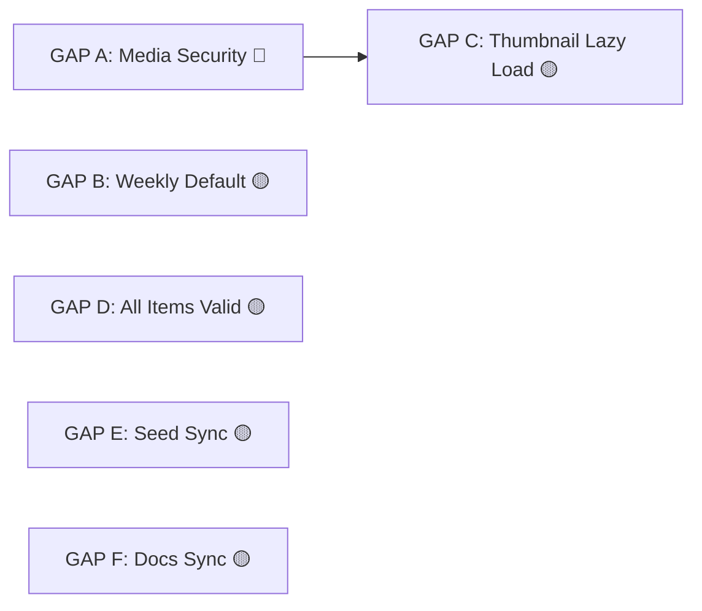

# Implementation Tracking — CONTEXT Audit GAP Fixes

> **Audit reference:** `docs/08-context-audit.md`
> **Ditemukan:** 2026-07-22

---

## Dependency Map



- **GAP A → GAP C**: Thumbnail akses butuh media auth selesai dulu
- **GAP B, D, E, F**: Independen, bisa paralel

---

## Issues List

### 🔴 Priority 1 — Security

| Issue | ID | Status | Claimed By | Blocked By | Files |
|-------|----|--------|------------|------------|-------|
| **GAP A: Media Security + One-Time Token** | `rsud-server-stack-60g` | 🟢 Done | buffy | None | `media/api.py`, `media/services.py`, `core/security.py` |

### 🟡 Priority 2 — Functionality

| Issue | ID | Status | Claimed By | Blocked By | Files |
|-------|----|--------|------------|------------|-------|
| **GAP B: Weekly Default View** | `rsud-server-stack-h36` | 🔴 Open | — | None | `analytics/api.py`, `analytics/services.py`, `analytics/models.py`, `hooks/useAnalytics.ts` |
| **GAP C: Thumbnail Lazy Load** | `rsud-server-stack-gi5` | 🟢 Done | buffy | GAP A | `inspection-detail.tsx`, `useInspections.ts` |
| **GAP D: All Items Validation** | `rsud-server-stack-quo` | 🟢 Done | buffy | None | `inspection/services.py`, `inspection/schemas.py` |

### 🟢 Priority 3 — Docs & Housekeeping

| Issue | ID | Status | Claimed By | Blocked By | Files |
|-------|----|--------|------------|------------|-------|
| **GAP E: Seed Sync** | `rsud-server-stack-92m` | 🟢 Done | buffy | None | `auth/CONTEXT.md` |
| **GAP F: Docs Sync** | `rsud-server-stack-9t5` | 🟢 Done | buffy | None | `docs/00-core-prompt.md`, `docs/01-database-schema.md` |

---

## Detail Per Issue

### GAP A: Media Security + One-Time Token

| Item | Detail |
|------|--------|
| **Severity** | 🔴 Kritis — Security |
| **Sumber** | `media/api.py:serve_file()` tanpa auth |
| **CONTEXT** | "Protected photo endpoints (not publicly exposed)", "One-Time Tokenized Route" |
| **Scope** | `media/api.py`, `media/services.py`, `core/security.py` (opsional) |

**Action:**
1. Tambah `Depends(get_current_user)` ke endpoint `GET /api/media/{filename}`
2. Buat endpoint baru `GET /api/media/token/{token}` untuk one-time token access
3. Fungsi generate token (short-lived JWT atau random string)
4. Update `media/CONTEXT.md` jika perlu

### GAP B: Weekly Default View

| Item | Detail |
|------|--------|
| **Severity** | 🟡 Sedang |
| **Sumber** | `analytics/api.py` + `useAnalytics.ts` default ke monthly |
| **CONTEXT** | "Default dashboard view is weekly, not monthly" ✅ (source of truth — benar) |
| **Scope** | `analytics/services.py`, `analytics/models.py`, `analytics/api.py`, `hooks/useAnalytics.ts` |

**Action (implementasi harus mengikuti CONTEXT):**
1. **Schema:** Tambah tabel `room_weekly_stats` dengan granularity `year_week` (format `YYYY-Www`), atau ubah `year_month` menjadi `period` dengan tipe discriminator (M=monthly, W=weekly)
2. **Service:** `recalculate_analytics()` — hitung stats per minggu (`year_week`) selain per bulan
3. **API:** Terima parameter `period` (M/W) dan `year_week` selain `year_month`
4. **Frontend:** Ubah `useAnalytics.ts` — default filter ke **current week** (format `YYYY-Www`), bukan `currentMonth()`
5. **CONTEXT.md:** Tidak perlu diubah — weekly sudah benar sebagai source of truth

### GAP C: Thumbnail Lazy Load

| Item | Detail |
|------|--------|
| **Severity** | 🟡 Sedang |
| **Sumber** | Frontend hanya tampilkan nama file, bukan thumbnail |
| **CONTEXT** | "Menampilkan thumbnail gambar secara lazy load" (PRD) |
| **Scope** | `inspection-detail.tsx`, `useInspections.ts` |

**Action:**
1. Di `inspection-detail.tsx`: render `` dengan `loading="lazy"` untuk thumbnail
2. URL thumbnail: `/api/media/thumb_{photo_file_name}`
3. **Blocked by GAP A** — media endpoint harus pakai auth dulu

### GAP D: All Items Validation

| Item | Detail |
|------|--------|
| **Severity** | 🟡 Minor |
| **Sumber** | `inspection/services.py:submit_inspection()` tanpa validasi |
| **CONTEXT** | "Every inspection must score all active inspection items assigned to the room" |
| **Scope** | `inspection/services.py`, `inspection/schemas.py` |

**Action:**
1. Query semua `InspectionItem` yang `is_active == True`
2. Validasi bahwa `item_ids` dari request mencakup semua active items
3. Jika tidak lengkap → raise `HTTPException(422)` atau `ValueError`

### GAP E: Seed Sync

| Item | Detail |
|------|--------|
| **Severity** | 🟡 Minor |
| **Sumber** | `auth/CONTEXT.md` bilang "via migration", kode via standalone |
| **CONTEXT** | "Seed Admin PPI via database migration — no self-registration" |
| **Scope** | `auth/CONTEXT.md` |

**Action:**
1. Update `auth/CONTEXT.md`: "Seed Admin PPI via standalone seed script (`app/seed.py` atau `python -m app.modules.auth.seed`)"

### GAP F: Docs Sync

| Item | Detail |
|------|--------|
| **Severity** | 🟡 Minor |
| **Sumber** | 2 file docs tidak sinkron |
| **Scope** | `docs/00-core-prompt.md`, `docs/01-database-schema.md` |

**Action:**
1. `docs/00-core-prompt.md`: `shadcn/ui` → `Planograph UI (custom Tailwind)`
2. `docs/01-database-schema.md`: Tambah status `PROCESSING`, kolom `retry_count` dan `max_retries` di `background_jobs`

---

## Recommended Claim Order

```
GAP A ──→ GAP C   (GAP A adalah prasyarat untuk thumbnail akses)
GAP B             (independen)
GAP D             (independen)
GAP E             (independen)
GAP F             (independen)
```

### Quick Start

```bash
# Lihat detail issue
bd show rsud-server-stack-60g
bd show rsud-server-stack-h36
bd show rsud-server-stack-gi5
bd show rsud-server-stack-quo
bd show rsud-server-stack-92m
bd show rsud-server-stack-9t5

# Claim issue
bd update <issue-id> --claim

# Tandai selesai (setelah implementasi & test)
bd update <issue-id> --status closed
```

---

## Workflow Per Issue

### Sebelum Mengerjakan
1. **Baca CONTEXT.md terkait** — pahami glossary dan key decisions domain
2. **Baca CODING-RULES.md** — pahami YAGNI/KISS/DRY
3. **Baca ADR terkait** — cek di `docs/adr/`
4. **Claim issue**: `bd update <issue-id> --claim`
5. **Update tracking file** — ubah status issue di tabel atas menjadi 🟡 In Progress

### Setelah Selesai
1. **`bd update <issue-id> --status closed`** — tandai selesai
2. **Update tracking file ini** — ubah status di tabel menjadi 🟢 Done
3. **Semua test passing**: `cd backend && PYTHONPATH=. uv run pytest -v`
4. **Update CONTEXT.md** jika ada perubahan behavior

---

## Pre-Commit Checklist (setiap issue)

- [ ] Semua test passing
- [ ] Tidak ada debug code / commented-out code
- [ ] Tidak ada file > 300 baris
- [ ] Tidak ada duplikasi yang tidak perlu
- [ ] Sesuai dengan ADRs dan CONTEXT.md
- [ ] CONTEXT.md sudah diupdate jika ada perubahan behavior
- [ ] Status tracking file ini sudah diupdate
- [ ] `bd update <issue-id> --status closed`

---

## Legend

| Symbol | Arti |
|--------|------|
| 🔴 Open / 🟡 Claimed / 🟢 Done | Status pengerjaan |
| 🔴 / 🟡 / 🟢 | Prioritas (Kritis / Sedang / Minor) |
