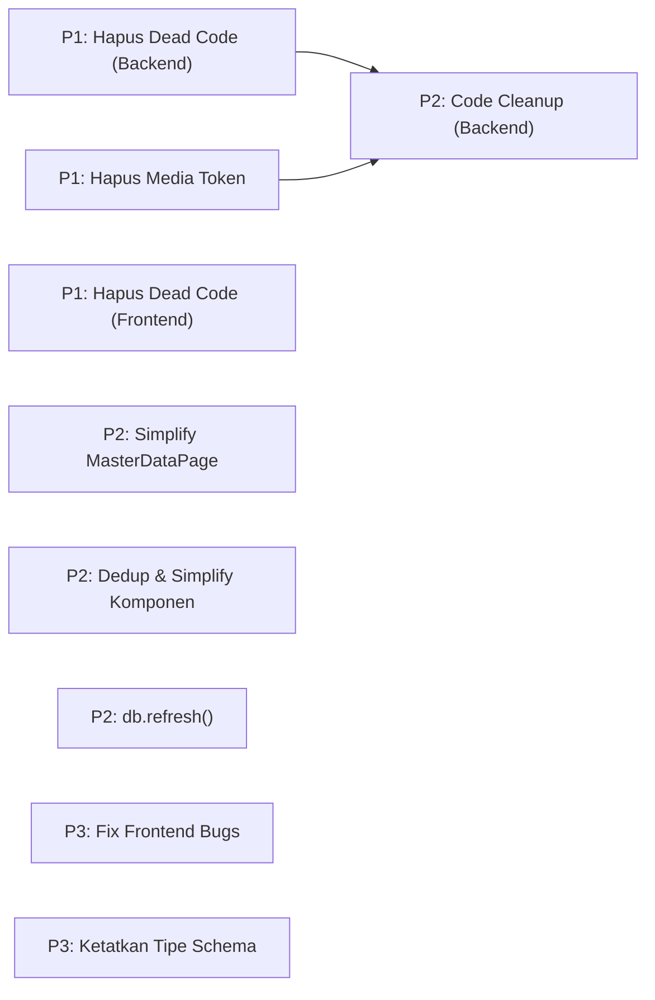

# 🐴 Optimasi PonyTail Audit — Checklist Claim Order

Daftar issue optimasi berdasarkan hasil ponytail-audit, diurutkan dari prioritas tertinggi (P1) ke terendah (P3).

---

## Dependency Map



---

## Claim Order

### 🔴 Prioritas 1 (P1) — High Impact, Low Effort

| # | Issue ID | Title | Status | Est. | Files |
|---|----------|-------|--------|:----:|-------|
| 1 | `rsud-server-stack-imw` | **Optimasi Backend — Hapus Dead Code & Duplikat Fungsi** | 🟢 Done | 5 menit | `auth/services.py` |
| 2 | `rsud-server-stack-74t` | **Optimasi FE — Hapus Dead Code: `useRoomUsers`** | 🟢 Done | 2 menit | `useUsers.ts` |
| 3 | `rsud-server-stack-41h` | **Optimasi Media — Hapus Token Endpoints & Simplify PhotoThumb** | 🟢 Done | 15 menit | `media/api.py`, `inspection-detail.tsx` |

**Ketergantungan:**
- `41h` menunggu `6j8` (jika ada conflict dengan lazy imports)

### 🟡 Prioritas 2 (P2) — Medium Impact

| # | Issue ID | Title | Status | Est. | Files |
|---|----------|-------|--------|:----:|-------|
| 4 | `rsud-server-stack-4kx` | **Optimasi FE — Simplify MasterDataPage & Inline CRUD** | 🟢 Done | 15 menit | `MasterDataPage.tsx`, `rooms.tsx`, `items.tsx` |
| 5 | `rsud-server-stack-dzb` | **Optimasi FE — Dedup & Simplify Komponen (`statusBadge`, `Bar`, `useCallback`)** | 🟢 Done | 10 menit | `inspections.tsx`, `inspection-detail.tsx`, `analytics.tsx`, `useAuth.tsx`, `users.tsx` |
| 6 | `rsud-server-stack-6j8` | **Optimasi Backend — Code Cleanup (Inline Helpers & Top-Level Imports)** | 🟢 Done | 10 menit | `master/services.py`, `analytics/api.py`, `auth/api.py` |
| 7 | `rsud-server-stack-r10` | **Optimasi Inspection — Ganti `_refetch_inspection` dengan `db.refresh()`** | 🟢 Done | 20 menit | `inspection/services.py` |

### 🟢 Prioritas 3 (P3) — Low Impact, Quick Wins

| # | Issue ID | Title | Status | Est. | Files |
|---|----------|-------|--------|:----:|-------|
| 8 | `rsud-server-stack-u9w` | **Optimasi Frontend — Fix `currentWeekMonth` & `generatePassword`** | 🟢 Done | 5 menit | `useAnalytics.ts`, `users.tsx` |
| 9 | `rsud-server-stack-hit` | **Optimasi Schema — Ketatkan tipe `SyncResponse.data`** | 🟢 Done | 2 menit | `master/schemas.py` |

---

## Execution Summary

| Priority | Issues | Est. Total | Risk |
|:--------:|:------:|:----------:|:----:|
| P1 | 3 | 22 menit | 🟢 Low (dead code removal) |
| P2 | 4 | 55 menit | 🟡 Medium (refactor / simplify) |
| P3 | 2 | 7 menit | 🟢 Low (typing/cleanup) |
| **Total** | **9** | **~84 menit** | |

---

## Workflow Per Issue

### Before Start

1. **Baca CODING-RULES.md** — pahami YAGNI/KISS/DRY
2. **Baca CONTEXT terkait** — cari di `backend/app/modules/<domain>/CONTEXT.md` atau `web-admin/src/CONTEXT.md`
3. **Claim issue**: `bd update <issue-id> --claim`
4. **Update status** di file ini → 🟡 In Progress

### After Complete

1. **Test backend**: `cd backend && uv run pytest -v`
2. **Typecheck frontend**: `cd web-admin && npx tsc -b`
3. **Close issue**: `bd update <issue-id> --status closed`
4. **Update status** di file ini → 🟢 Done
5. **Commit**: `git add . && git commit -m "<type>: <deskripsi>"`

---

## Quick Start

```bash
# Lihat semua issue
bd list --prefix rsud-server-stack --status open

# Lihat detail issue
bd show rsud-server-stack-74t

# Claim issue
bd update rsud-server-stack-74t --claim

# Close issue
bd update rsud-server-stack-74t --status closed
```

---

## Legend

| Symbol | Arti |
|--------|------|
| 🔴 Open | Belum dikerjakan |
| 🟡 In Progress | Sedang dikerjakan (claimed) |
| 🟢 Done | Selesai |
| ⏸️ Blocked | Menunggu issue lain |
