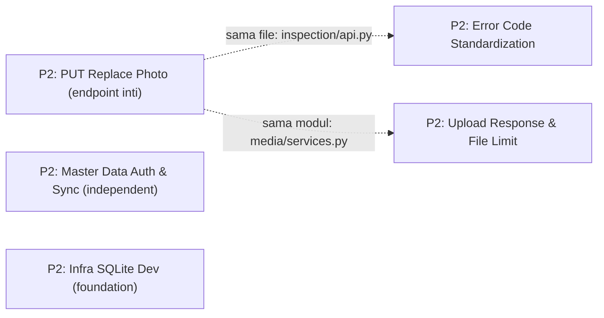

# 📸 Replace Photo Endpoint — Checklist Claim Order

Checklist pengerjaan untuk **`PUT /api/inspections/{id}/photos/{photoId}`** (Replace Photo) beserta issue-issue terbuka yang beririsan file. Diurutkan berdasarkan prioritas & dependensi — claim issue dengan `bd update <issue-id> --claim` sebelum mulai.

> **Sumber desain**: ADR-0012 (`docs/adr/0012-replace-photo-endpoint.md`) · Contract section 4.6 (`docs/android-to-be-api-contract.md`) · Issue `rsud-server-stack-pi7`

---

## Dependency Map



> ⚠️ Tanda `-. ... .->` di atas = **rekomendasi urutan claim karena file/modul beririsan**, bukan dependency yang memblokir. `pi7`, `3bh`, `0zn` menyentuh file yang sama → claim berurutan, bukan paralel, agar tidak bentrok saat rebase/commit.

---

## Claim Order

### 🔴 Task Inti — `rsud-server-stack-pi7`

| # | Issue ID | Title | Status | Est. | Files |
|---|----------|-------|--------|:----:|-------|
| 1 | `rsud-server-stack-pi7` | **Implement PUT /api/inspections/{id}/photos/{photoId} — Replace Photo** | 🟢 Done | ~45 menit | `inspection/services.py`, `inspection/api.py`, `tests/test_inspection.py`, `docs/android-to-be-api-contract.md` |

**Sub-tasks `pi7` (urutan implementasi dalam issue):**

- [ ] **Task 1 — Service `replace_inspection_photo()`** (`inspection/services.py`): validasi inspeksi ada + akses (owner ATAU supervisor/admin), validasi photo milik inspeksi, reuse `save_upload()` (media), update `photo_file_name` + `thumbnail_file_name=null`, `create_job("generate_thumbnail")` sebelum commit, hapus sinkron file lama + `thumb_*` setelah commit
- [ ] **Task 2 — Endpoint PUT** (`inspection/api.py`): multipart field `file`, response `PhotoOut`, errors `404 PHOTO_NOT_FOUND` / `403` / `413 FILE_TOO_LARGE`
- [ ] **Task 3 — Tests** (`tests/test_inspection.py`): happy path, 404, 403 (bukan owner), 413 (>10MB)
- [ ] **Task 4 — Docs**: update contract section 4.6 → tandai sudah didesain (menunggu implementasi) + tabel ringkasan

**Ketergantungan:** tidak ada (DEPS: `[]`) — bisa langsung di-claim. ADR-0012 sudah siap sebagai referensi.

### 🟡 Issue Beririsan (claim SETELAH `pi7`)

| # | Issue ID | Title | Status | Est. | Overlap dgn `pi7` |
|---|----------|-------|--------|:----:|--------------------|
| 2 | `rsud-server-stack-3bh` | **Error Code Standardization** | 🟢 Done | ~15 menit | `inspection/api.py` (sama file) |
| 3 | `rsud-server-stack-0zn` | **Upload Response & File Limit** | 🟢 Done | ~20 menit | `media/services.py` (`save_upload`) |

> Urutan disarankan: `pi7` → `3bh` → `0zn`. `0zn` mengubah signature return `save_upload` (tambah `file_size`) — kerjakan setelah `pi7` selesai agar `pi7` memakai `save_upload` yang stabil.

### 🟢 Issue Independent (bisa paralel / kapan saja)

| # | Issue ID | Title | Status | Est. | Catatan |
|---|----------|-------|--------|:----:|---------|
| 4 | `rsud-server-stack-9ca` | **Master Data Auth & Sync** | 🟢 Done | ~40 menit | Module `master/` — sudah selesai di kode + test existing |
| 5 | `rsud-server-stack-lu3` | **Infra Migrasi SQLite Dev** | 🟢 Done | verifikasi + close | Foundation — sudah di working tree, diverifikasi & ditutup |

---

## Execution Summary

| Grup | Issues | Est. Total | Risiko |
|:----:|:------:|:----------:|:------:|
| Inti (`pi7`) | 1 | ~45 menit | 🟡 Medium (endpoint baru + file handling) |
| Beririsan (3bh, 0zn) | 2 | ~35 menit | 🟢 Low (standardisasi/format, file sudah ada) |
| Independent (9ca, lu3) | 2 | ~40 menit | 🟡 Medium (9ca: migration + schema) |
| **Total** | **5** | **~120 menit** | |

---

## Workflow Per Issue

### Before Start

1. **Baca `CODING-RULES.md`** — pahami YAGNI/KISS/DRY, max 300 baris/file
2. **Baca desain**: `docs/adr/0012-replace-photo-endpoint.md` (untuk `pi7`)
3. **Baca CONTEXT terkait**: `backend/app/modules/inspection/CONTEXT.md` (term *Photo Replacement*), `backend/app/modules/media/CONTEXT.md`
4. **Claim issue**: `bd update <issue-id> --claim`
5. **Update status** di file ini → 🟡 In Progress

### After Complete

1. **Test backend**: `cd backend && uv run pytest tests/test_inspection.py -v`
2. **Full regression**: `cd backend && uv run pytest -v`
3. **Close issue**: `bd update <issue-id> --status closed`
4. **Update status** di file ini → 🟢 Done
5. **Commit**: `git add . && git commit -m "<type>: <deskripsi>"`

---

## Quick Start

```bash
# Lihat semua issue open
bd list --prefix rsud-server-stack --status open

# Detail issue inti
bd show rsud-server-stack-pi7

# Claim issue
bd update rsud-server-stack-pi7 --claim

# Close issue
bd update rsud-server-stack-pi7 --status closed
```

---

## Legend

| Symbol | Arti |
|--------|------|
| 🔴 Open | Belum dikerjakan |
| 🟡 In Progress | Sedang dikerjakan (claimed) |
| 🟢 Done | Selesai |
| ⏸️ Blocked | Menunggu issue lain |

---

## Referensi

- ADR-0012: `docs/adr/0012-replace-photo-endpoint.md`
- Contract: `docs/android-to-be-api-contract.md` section 4.6 & 5
- Issue inti: `rsud-server-stack-pi7`
- House style file ini: `docs/optimasi-checklist.md`
