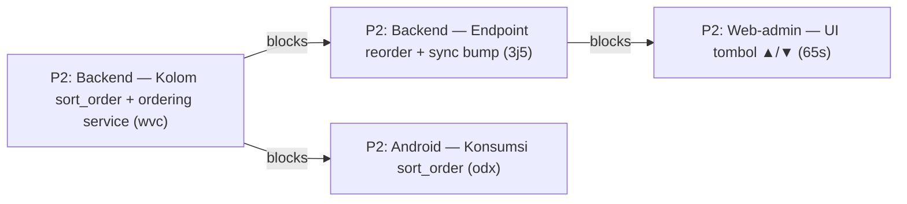

# 🧭 Room-Item Ordering (ADR-0013) — Checklist Claim Order

Checklist pengerjaan **ADR-0013 — Urutan Item Inspeksi per Ruangan** (kolom `sort_order` di pivot `room_items`) beserta issue-issue terbukanya. Diurutkan berdasarkan dependensi — claim issue dengan `bd update <issue-id> --claim` sebelum mulai.

> **Sumber desain**: ADR-0013 (`docs/adr/0013-room-item-ordering.md`) · Contract §2.2 (`docs/android-to-be-api-contract.md`) · Glossary `backend/app/modules/master/CONTEXT.md` (term *Inspection Sequence*)

---

## Dependency Map



> **Frontier** (bisa dikerjakan sekarang): hanya `wvc`. Blocking edges terpasang native via `bd dep add` — verifikasi dengan `bd ready`.

---

## Claim Order

### 🔴 Ticket 1 — FRONTIER (bisa langsung di-claim): `rsud-server-stack-wvc`

| # | Issue ID | Title | Status | Est. | Files |
|---|----------|-------|--------|:----:|-------|
| 1 | `rsud-server-stack-wvc` | **Backend: Kolom `sort_order` di room_items + ordering service** | 🟢 Done | ~45 menit | `master/models.py`, `master/schemas.py`, `master/services.py`, migration baru, `tests/test_room_items.py` |

**Sub-tasks `wvc` (urutan implementasi dalam issue):**

- [x] **Task 1 — Migration**: tambah kolom `room_items.sort_order` (Integer, default 0) + backfill `sort_order = item_id` untuk baris existing
- [x] **Task 2 — Model & Schema**: `RoomItem.sort_order` + `RoomItemOut.sort_order`
- [x] **Task 3 — Service ordering**: `list_items_by_room()` & `list_room_items()` → `ORDER BY sort_order ASC, item_id ASC`
- [x] **Task 4 — Assign**: `assign_item_to_room()` men-set `sort_order = max(existing)+1` (append di akhir ruangan)
- [x] **Task 5 — Tests**: ordering, backfill, posisi item baru

**Ketergantungan:** tidak ada (blocked by: None) — langsung bisa di-claim. ADR-0013 sudah siap sebagai referensi.

### 🟡 Ticket 2 (blocked by `wvc`): `rsud-server-stack-3j5`

| # | Issue ID | Title | Status | Est. | Blocked by |
|---|----------|-------|--------|:----:|------------|
| 2 | `rsud-server-stack-3j5` | **Backend: Endpoint reorder room-items (admin) + sync bump** | 🟢 Done | ~30 menit | `wvc` |

**Sub-tasks `3j5`:**

- [x] **Task 1 — Endpoint**: `PUT /api/rooms/{id}/items/reorder` (admin-only), body `{ "item_ids": [...] }`
- [x] **Task 2 — Service**: hitung ulang `sort_order` sesuai posisi; hanya baris berubah yang dibump `updated_at`-nya
- [x] **Task 3 — Validasi**: daftar `item_ids` harus persis item aktif milik room (bukan subset/kelebihan)
- [x] **Task 4 — Tests**: reorder normal, item tidak valid ditolak, perubahan muncul di sync `GET /api/room-items?since=`

### 🟡 Ticket 3 (blocked by `3j5`): `rsud-server-stack-65s`

| # | Issue ID | Title | Status | Est. | Blocked by |
|---|----------|-------|--------|:----:|------------|
| 3 | `rsud-server-stack-65s` | **Web-admin: UI reorder tombol ▲/▼ di halaman Room** | 🟢 Done | ~45 menit | `3j5` |

**Sub-tasks `65s`:**

- [x] **Task 1 — Hook**: mutation reorder (panggil endpoint T2) + invalidasi query `["room-items"]` & `["rooms"]`
- [x] **Task 2 — UI**: daftar item ruangan menampilkan urutan `sort_order` dari API
- [x] **Task 3 — Tombol ▲/▼**: klik → reorder → tampilan ter-update; disabled state di posisi ujung (▲ di item pertama, ▼ di item terakhir)
- [x] **Task 4 — Verifikasi**: tanpa dependency baru (tidak ada library drag & drop)

### 🟡 Ticket 4 (blocked by `wvc` — bisa paralel dengan 3j5/65s): `rsud-server-stack-odx`

| # | Issue ID | Title | Status | Est. | Blocked by |
|---|----------|-------|--------|:----:|------------|
| 4 | `rsud-server-stack-odx` | **Android: Konsumsi `sort_order` & urutkan checklist** | 🟢 Done (docs) | ~30 menit | `wvc` |

**Sub-tasks `odx`:**

- [x] **Task 1 — Entity**: `RoomItem` lokal (Android) menyimpan `sort_order` dari `GET /api/room-items` (panduan + contoh kode di docs)
- [x] **Task 2 — Ordering**: checklist inspeksi room diurutkan `(sort_order, item_id)` — tie-breaker `item_id` (panduan + contoh kode di docs)
- [x] **Task 3 — Sync**: reorder admin sampai ke Android via `?since=` (updated_at dibump) (panduan di docs)
- [x] **Task 4 — Docs**: update `docs/android-implementation-guide.md` (entity RoomItem + aturan urut + contoh kode)

> 📌 Contract `docs/android-to-be-api-contract.md` §2.2 **sudah ter-update** (payload `sort_order` + contoh Kotlin) — `odx` tinggal mengikuti.

---

## Execution Summary

| Grup | Issues | Est. Total | Risiko |
|:----:|:------:|:----------:|:------:|
| Frontier (`wvc`) | 1 | ~45 menit | 🟢 Done |
| Backend (`3j5`) | 1 | ~30 menit | 🟢 Done |
| Frontend (`65s`) | 1 | ~45 menit | 🟢 Done |
| Android (`odx`) | 1 | ~30 menit | 🟢 Done (docs) |
| **Total** | **4** | **~150 menit** | ✅ Semua selesai (7 Aug 2026) |

---

## Workflow Per Issue

### Before Start

1. **Baca `CODING-RULES.md`** — pahami YAGNI/KISS/DRY, max 300 baris/file
2. **Baca desain**: `docs/adr/0013-room-item-ordering.md`
3. **Baca CONTEXT terkait**: `backend/app/modules/master/CONTEXT.md` (term *Inspection Sequence*), `docs/android-to-be-api-contract.md` §2.2 (untuk `odx`)
4. **Claim issue**: `bd update <issue-id> --claim`
5. **Update status** di file ini → 🟡 In Progress

### After Complete

1. **Test backend**: `cd backend && uv run pytest tests/test_room_items.py -v`
2. **Full regression**: `cd backend && uv run pytest -v`
3. **Test frontend** (untuk `65s`): `cd web-admin && npx tsc --noEmit` + `npm run build`
4. **Close issue**: `bd update <issue-id> --status closed`
5. **Update status** di file ini → 🟢 Done
6. **Commit**: `git add . && git commit -m "<type>: <deskripsi>"`

---

## Quick Start

```bash
# Lihat frontier (issue tanpa blocker)
bd ready

# Detail issue
bd show rsud-server-stack-wvc

# Claim issue (mulai dari frontier)
bd update rsud-server-stack-wvc --claim

# Lihat dependency graph
bd dep tree rsud-server-stack-wvc

# Close issue setelah selesai
bd update rsud-server-stack-wvc --status closed
```

---

## Legend

| Symbol | Arti |
|--------|------|
| 🔴 Open | Belum dikerjakan |
| 🟡 In Progress | Sedang dikerjakan (claimed) |
| 🟢 Done | Selesai |
| 🔒 Blocked | Menunggu issue lain (blocking edge native) |

---

## Referensi

- ADR-0013: `docs/adr/0013-room-item-ordering.md`
- Contract: `docs/android-to-be-api-contract.md` section 2.2 & 5
- Issues: `wvc` (frontier), `3j5`, `65s`, `odx`
- House style file ini: `docs/replace-photo-claim-order.md`, `docs/phase-09-implementation-checklist.md`
